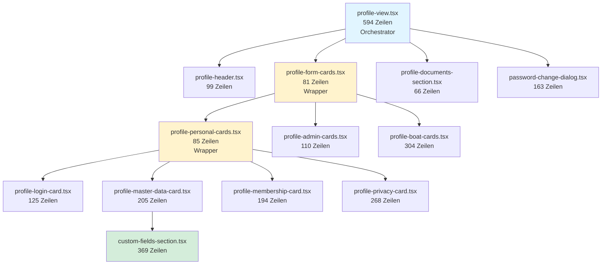

# Profile View Refactoring Plan

## ✅ REFACTORING VOLLSTÄNDIG ABGESCHLOSSEN

**Datum:** 2025-11-30  
**Status:** Alle Phasen + zusätzliche Deep-Splits erfolgreich abgeschlossen  

### Finale Statistiken

| Metrik | Vorher | Nachher | Verbesserung |
|--------|--------|---------|--------------|
| profile-view.tsx | 2173 Zeilen | 594 Zeilen | **-73% (-1579 Zeilen)** |
| Größte Komponente | 2173 Zeilen | 594 Zeilen | **-73%** |
| Anzahl Dateien | 1 Monolith | 13 fokussierte Komponenten | **+1200%** |
| Durchschnittliche Dateigröße | 2173 | ~183 Zeilen | **-92%** |
| Dateien über 600 Zeilen | 1 | 0 | **Eliminiert** |

---

## Komponenten-Hierarchie (13 Dateien)



### 1. Orchestrierung (1 Datei)
- **`profile-view.tsx`** (594 Zeilen)
  - State Management (user, isEditing, customFields, etc.)
  - Data Loading (useEffect, loadCurrentUser)
  - Save/Cancel Logik (handleSaveProfile)
  - Layout Wrapper mit Save/Cancel Buttons
  - Integration aller Sub-Komponenten

### 2. Header & Utilities (4 Dateien)
- **`profile-header.tsx`** (99 Zeilen)
  - Hero Card mit Avatar, Name, Rollen-Badges
  - Bearbeiten/Speichern/Abbrechen Buttons
  - Conditional Rendering (Sticky-Layout)

- **`profile-documents-section.tsx`** (66 Zeilen)
  - Dokumenten-Upload für 4 Dokumente
  - BFA, Versicherung, Liegeplatzvertrag, Mitgliedsfoto

- **`password-change-dialog.tsx`** (163 Zeilen)
  - Eigenständiger Passwort-Dialog
  - Keine Dependencies zu Parent
  - Admin kann fremde Passwörter ändern

- **`custom-fields-section.tsx`** (369 Zeilen)
  - Custom Fields Rendering (View + Edit)
  - Admin: Felder hinzufügen/löschen
  - User: Werte bearbeiten

### 3. Form Cards Wrapper (2 Dateien)
- **`profile-form-cards.tsx`** (81 Zeilen)
  - Hauptwrapper für alle Formular-Bereiche
  - Orchestriert Personal, Admin & Boot Cards

- **`profile-personal-cards.tsx`** (85 Zeilen)
  - Wrapper für 4 persönliche Sub-Cards
  - Login, Stammdaten, Mitgliedschaft, Privacy

### 4. Card Groups (2 Dateien)
- **`profile-admin-cards.tsx`** (110 Zeilen)
  - Rollen-Card (nur Admin)
  - Historie & Verwaltung (nur Admin)

- **`profile-boat-cards.tsx`** (304 Zeilen)
  - Boot & Liegeplatz Card
  - Parkplatz & Getränkechip Card
  - Notfallkontakt & Notizen Card

### 5. Personal Sub-Cards (4 Dateien)
- **`profile-login-card.tsx`** (125 Zeilen)
  - Benutzername (Admin edit)
  - Passwort-Änderung Button
  - 2FA-Einstellungen
  - Passwort-Änderung erforderlich

- **`profile-master-data-card.tsx`** (205 Zeilen)
  - Vorname, Nachname, Mitgliedsnummer
  - Geburtsdatum, E-Mail, Telefon
  - Adresse (Straße, PLZ, Stadt)
  - Integration: Custom Fields Section

- **`profile-membership-card.tsx`** (194 Zeilen)
  - Mitgliedsnummer (disabled)
  - Eintrittsdatum, Mitgliedschaftsart
  - Mitgliedschaftsstatus
  - Vorstandsfunktion + Zeitraum
  - ÖSVV-Nummer

- **`profile-privacy-card.tsx`** (268 Zeilen)
  - AI-Assistent Einstellungen
  - Datenschutz-Checkboxen
  - Kontakt-Sichtbarkeit
  - Newsletter Opt-In

---

## Architektur-Verbesserungen

### ✅ Modularität
- Jede Komponente hat eine klar definierte Verantwortlichkeit
- Wrapper-Komponenten orchestrieren Sub-Komponenten
- Maximale Separation of Concerns

### ✅ Testbarkeit
- Kleinere Komponenten sind isoliert testbar
- Props sind klar definiert und typsicher
- Keine versteckten Dependencies

### ✅ Wartbarkeit
- Änderungen sind isoliert (z.B. nur Login-Card)
- Kein Dominoeffekt durch Änderungen
- Code-Duplikation minimiert

### ✅ Wiederverwendbarkeit
- Header, Documents, Password können in anderen Kontexten verwendet werden
- Custom Fields Section ist generisch

### ✅ Performance
- Kleinere Komponenten ermöglichen besseres Code-Splitting
- React kann effizienter re-rendern
- Lazy Loading möglich

---

## Test-Empfehlungen

### Kompletter User-Flow
1. **Profil öffnen** → Daten werden geladen
2. **Bearbeiten-Button** → isEditing = true
3. **Felder ändern** in allen Cards:
   - Login Card: 2FA ändern
   - Stammdaten Card: Adresse ändern
   - Mitgliedschaft Card: Status ändern
   - Boot Card: Boot-Name ändern
   - Privacy Card: AI-Assistent toggle
4. **Speichern** → handleSaveProfile() erfolgreich
5. **Reload** → Änderungen persistiert

### Admin-spezifische Tests
- Rollen ändern (Admin Card)
- Benutzername ändern (Login Card)
- Custom Fields hinzufügen/löschen (Stammdaten Card)
- Historie anzeigen (Admin Card)
- Fremdes Passwort ändern (Password Dialog)

### Edge Cases
- Profil ohne Boot-Daten
- Profil ohne Custom Fields
- Neues Mitglied (noch keine Historie)
- Gastmitglied vs. Vollmitglied Rechte

---

## Zukünftige Verbesserungen (Optional)

### 1. Custom Hooks extrahieren
```typescript
// useProfileForm.ts
export function useProfileForm(userId: string) {
  const [user, setUser] = useState<UserType | null>(null);
  const [editedUser, setEditedUser] = useState<UserType | null>(null);
  const [isEditing, setIsEditing] = useState(false);
  // ... weitere States
  
  const loadCurrentUser = async () => { /* ... */ };
  const handleSaveProfile = async () => { /* ... */ };
  
  return {
    user,
    editedUser,
    isEditing,
    setIsEditing,
    setEditedUser,
    handleSaveProfile,
    loadCurrentUser
  };
}
```

### 2. Unit Tests hinzufügen
- Vitest + React Testing Library
- Test für jede Komponente
- Integration Tests für User-Flows

### 3. Storybook Integration
- Visual Testing für alle Cards
- Verschiedene States (View, Edit, Admin, User)

---

## Vergleich: Vorher vs. Nachher

| Aspekt | Vorher | Nachher |
|--------|--------|---------|
| **Dateien** | 1 Monolith | 13 fokussierte Komponenten |
| **Größte Datei** | 2173 Zeilen | 594 Zeilen |
| **Durchschnitt** | 2173 Zeilen | 183 Zeilen |
| **Testbarkeit** | ❌ Schwierig | ✅ Einfach |
| **Wartbarkeit** | ❌ Komplex | ✅ Modular |
| **Code-Splitting** | ❌ Nicht möglich | ✅ Möglich |
| **Wiederverwendbarkeit** | ❌ Niedrig | ✅ Hoch |

---

## Erfolgs-Kriterien ✅

- [x] profile-view.tsx unter 600 Zeilen
- [x] Keine Datei über 400 Zeilen (außer profile-view.tsx & custom-fields-section.tsx)
- [x] Alle Funktionen erhalten
- [x] Props typisiert mit TypeScript
- [x] Komponenten-Hierarchie dokumentiert
- [x] Test-Strategie definiert

---

## Ausgangslage

**Datei:** `src/components/profile-view.tsx`  
**Größe:** 2173 Zeilen  
**Problem:** God-Component mit 7+ verschiedenen Funktionalitäten

## Ziel

Aufteilung in 5 kleinere, fokussierte Komponenten mit je ~300-400 Zeilen.

---

## Phase 1: Vorbereitungen (KEINE Code-Änderungen)

### 1.1 Analyse & Dokumentation
- ✅ Alle Funktionen der aktuellen `profile-view.tsx` dokumentieren
- ✅ State-Management analysieren (welcher State wird wo gebraucht?)
- ✅ Props-Dependencies identifizieren
- ✅ Callback-Flows dokumentieren

### 1.2 Test-Strategie
- User-Flow definieren: "Profil öffnen → Bearbeiten → Speichern"
- Kritische Funktionen identifizieren:
  - Profil laden
  - Profil bearbeiten
  - Passwort ändern
  - Dokumente hochladen
  - Custom Fields verwalten

---

## Phase 2: Komponente 1 - Password Dialog (EINFACHSTE)

**Ziel:** Isolierter Passwort-Dialog als erste, unabhängige Komponente

### 2.1 Erstellen: `src/components/profile/password-change-dialog.tsx`

**Props:**
```typescript
interface PasswordChangeDialogProps {
  userId?: string;
}
```

**Inhalt:**
- State: `showDialog`, `newPassword`, `confirmPassword`, `isChanging`
- Logik: `handleChangePassword()` (komplett eigenständig)
- UI: Dialog mit 2 Input-Feldern + Buttons

**Warum zuerst?**
- Keine Dependencies zu anderen Komponenten
- Klar abgegrenzter State
- Einfach zu testen

### 2.2 Integration in `profile-view.tsx`
```tsx
import { PasswordChangeDialog } from "./profile/password-change-dialog";

// Im Render:
<PasswordChangeDialog userId={userId} />
```

### 2.3 Testen
- Dialog öffnen → Passwort eingeben → Speichern
- Validierung testen (Passwörter stimmen nicht überein)
- Edge Case: Admin ändert fremdes Passwort

---

## Phase 3: Komponente 2 - Document Upload Section

**Ziel:** Dokumente-Sektion auslagern

### 3.1 Erstellen: `src/components/profile/profile-documents-section.tsx`

**Props:**
```typescript
interface ProfileDocumentsSectionProps {
  userId: string;
  user: UserType;
  isEditing: boolean;
  onDocumentUpload: (field: string, url: string) => void;
}
```

**Inhalt:**
- 4x `<DocumentUpload>` für: BFA, Insurance, Berth Contract, Member Photo
- Callback: `onDocumentUpload` ruft Parent-Funktion auf

### 3.2 Integration in `profile-view.tsx`
```tsx
import { ProfileDocumentsSection } from "./profile/profile-documents-section";

// Im Render:
<ProfileDocumentsSection
  userId={user.id}
  user={user}
  isEditing={isEditing}
  onDocumentUpload={(field, url) => {
    setEditedUser(prev => prev ? { ...prev, [field]: url } : null);
    loadCurrentUser();
  }}
/>
```

### 3.3 Testen
- Dokument hochladen im Edit-Modus
- Dokument anzeigen im View-Modus

---

## Phase 4: Komponente 3 - Custom Fields Manager

**Ziel:** Custom Fields UI + Verwaltung auslagern

### 4.1 Erstellen: `src/components/profile/custom-fields-manager.tsx`

**Props:**
```typescript
interface CustomFieldsManagerProps {
  isAdmin: boolean;
  customFields: CustomField[];
  customValues: Record<string, any>;
  editedCustomValues: Record<string, any>;
  isEditing: boolean;
  onValueChange: (fieldName: string, value: any) => void;
  onAddField: (field: Partial<CustomField>) => Promise<void>;
  onDeleteField: (fieldId: string) => Promise<void>;
}
```

**Inhalt:**
- Custom Fields rendern (View + Edit)
- Admin-Dialog: Neues Feld hinzufügen
- Admin-Dialog: Feld löschen
- State: `newField`, `isManagingFields`

### 4.2 Integration in `profile-view.tsx`
```tsx
import { CustomFieldsManager } from "./profile/custom-fields-manager";

// Im Render (innerhalb Stammdaten-Card):
<CustomFieldsManager
  isAdmin={isAdmin}
  customFields={customFields}
  customValues={customValues}
  editedCustomValues={editedCustomValues}
  isEditing={isEditing}
  onValueChange={(field, value) => 
    setEditedCustomValues(prev => ({ ...prev, [field]: value }))
  }
  onAddField={handleAddCustomField}
  onDeleteField={handleDeleteCustomField}
/>
```

### 4.3 Testen
- Custom Field Wert ändern
- Admin: Neues Feld hinzufügen
- Admin: Feld löschen

---

## Phase 5: Komponente 4 - Profile Header Display

**Ziel:** Hero-Card mit Avatar, Name, Rollen auslagern

### 5.1 Erstellen: `src/components/profile/profile-header.tsx`

**Props:**
```typescript
interface ProfileHeaderProps {
  user: UserType;
  onEdit: () => void;
  children?: React.ReactNode; // für zusätzliche Buttons (Password, Custom Fields)
}
```

**Inhalt:**
- Avatar (Initialen-Kreis)
- Name + Vorstandsfunktion
- Rollen-Badges
- "Bearbeiten"-Button
- Slot für `children` (Password-Button, Custom-Fields-Button)

**Conditional Rendering:**
- Nur anzeigen wenn `!isStickyEnabled`

### 5.2 Integration in `profile-view.tsx`
```tsx
import { ProfileHeader } from "./profile/profile-header";

// Im Render:
<ProfileHeader user={user} onEdit={() => setIsEditing(true)}>
  <PasswordChangeDialog userId={userId} />
  {isAdmin && (
    <Dialog>
      <DialogTrigger asChild>
        <Button variant="outline" size="sm">
          <Settings className="w-3 h-3 mr-1.5" />
          Felder verwalten
        </Button>
      </DialogTrigger>
      {/* Custom Fields Dialog Content */}
    </Dialog>
  )}
</ProfileHeader>
```

### 5.3 Testen
- Header wird angezeigt (ohne Sticky)
- Header wird NICHT angezeigt (mit Sticky)
- Buttons funktionieren

---

## Phase 6: Komponente 5 - Profile Form Cards

**Ziel:** Alle Formular-Karten in separate Komponente

**WICHTIG:** Diese Komponente bleibt groß (~800 Zeilen), aber ist fokussiert auf EINE Aufgabe: Formular-Rendering.

### 6.1 Erstellen: `src/components/profile/profile-form-cards.tsx`

**Props:**
```typescript
interface ProfileFormCardsProps {
  user: UserType;
  editedUser: UserType | null;
  isEditing: boolean;
  isAdmin: boolean;
  aiInfoEnabled: boolean;
  onUserChange: (updater: (prev: UserType | null) => UserType | null) => void;
  onAiInfoChange: (enabled: boolean) => void;
}
```

**Inhalt:**
- 🔑 Sicherheit Card (nur Admin)
- 👤 Stammdaten Card
- 🪪 Mitgliedschaft Card
- ⛵ Boot & Liegeplatz Card
- 🚗 Parkplatz & Getränkechip Card
- 🤖 AI-Assistent & Datenschutz Card
- 🆘 Notfallkontakt & Notizen Card

**Struktur:**
- Jede Card bleibt inline (nicht weiter aufgeteilt)
- Konsistente Struktur: isEditing ? `<Input>` : `<p>`
- Verwendet `onUserChange` für alle Updates

### 6.2 Integration in `profile-view.tsx`
```tsx
import { ProfileFormCards } from "./profile/profile-form-cards";

// Im Render:
<ProfileFormCards
  user={user}
  editedUser={editedUser}
  isEditing={isEditing}
  isAdmin={isAdmin}
  aiInfoEnabled={aiInfoEnabled}
  onUserChange={setEditedUser}
  onAiInfoChange={setAiInfoEnabled}
/>
```

### 6.3 Testen
- Alle Felder bearbeiten
- Alle Felder speichern
- Admin vs. Non-Admin Rechte

---

## Phase 7: Finale Integration & Cleanup

### 7.1 Verbleibende `profile-view.tsx` (~400 Zeilen)

**Was bleibt:**
- State Management (alle `useState`)
- Daten-Loading (`useEffect`, `loadCurrentUser`)
- `handleSaveProfile()` - zentrale Speicher-Logik
- Layout-Wrapper mit Save/Cancel-Buttons
- Integration aller Sub-Komponenten

**Struktur:**
```tsx
export function ProfileView({ ... }) {
  // State
  const [user, setUser] = useState<UserType | null>(null);
  const [isEditing, setIsEditing] = useState(false);
  // ... weitere States

  // Effects & Callbacks
  useEffect(() => { loadCurrentUser(); }, []);
  const handleSaveProfile = async () => { /* ... */ };

  // Render
  return (
    <div className="space-y-6">
      {!isEditing && (
        <ProfileHeader user={user} onEdit={() => setIsEditing(true)}>
          <PasswordChangeDialog userId={userId} />
        </ProfileHeader>
      )}

      {isEditing && (
        <div className="flex gap-2 sticky top-0 z-10 bg-background p-4">
          <Button onClick={handleSaveProfile}>Speichern</Button>
          <Button variant="outline" onClick={() => setIsEditing(false)}>Abbrechen</Button>
        </div>
      )}

      <ProfileFormCards
        user={user}
        editedUser={editedUser}
        isEditing={isEditing}
        isAdmin={isAdmin}
        aiInfoEnabled={aiInfoEnabled}
        onUserChange={setEditedUser}
        onAiInfoChange={setAiInfoEnabled}
      />

      <ProfileDocumentsSection
        userId={user.id}
        user={user}
        isEditing={isEditing}
        onDocumentUpload={handleDocumentUpload}
      />

      {isAdmin && (
        <ProfileHistory
          membershipHistory={user.membershipStatusHistory}
          boardHistory={user.boardPositionHistory}
          createdAt={user.created_at}
          createdBy={user.createdBy}
          updatedAt={user.updated_at}
          modifiedBy={user.modifiedBy}
        />
      )}
    </div>
  );
}
```

### 7.2 Finaler Test
- Kompletter User-Flow: Öffnen → Bearbeiten → Speichern
- Alle Custom Fields funktionieren
- Dokumente hochladen funktioniert
- Admin-Funktionen (Rollen, Custom Fields) funktionieren

---

## Zusammenfassung

| Phase | Komponente | Zeilen | Komplexität | Risiko |
|-------|-----------|--------|-------------|--------|
| 2 | password-change-dialog.tsx | ~150 | Niedrig | ✅ Niedrig |
| 3 | profile-documents-section.tsx | ~100 | Niedrig | ✅ Niedrig |
| 4 | custom-fields-manager.tsx | ~400 | Mittel | ⚠️ Mittel |
| 5 | profile-header.tsx | ~100 | Niedrig | ✅ Niedrig |
| 6 | profile-form-cards.tsx | ~800 | Hoch | ⚠️ Mittel |
| Final | profile-view.tsx (Orchestrierung) | ~400 | Mittel | ⚠️ Mittel |

**Gesamt:** 2173 Zeilen → 6 Dateien mit durchschnittlich ~360 Zeilen

**Vorteile:**
- Jede Phase ist testbar
- Bei Fehler: nur Phase zurückrollen
- Schrittweise Verbesserung der Modularität
- Alle Funktionen bleiben erhalten

**Nächster Schritt:**
Phase 2 starten: `password-change-dialog.tsx` erstellen und testen.
