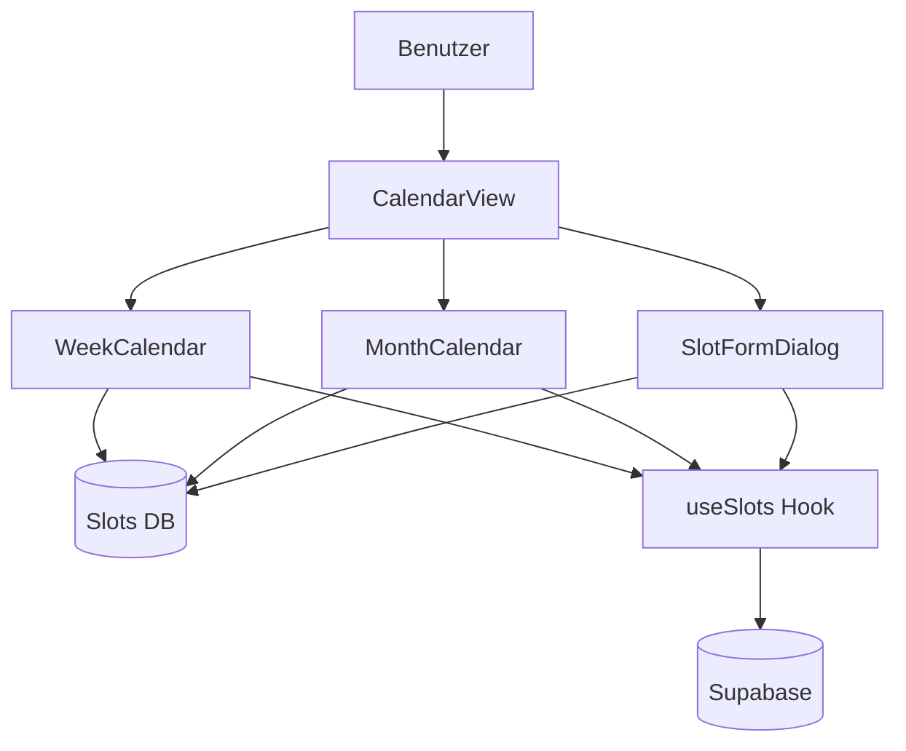
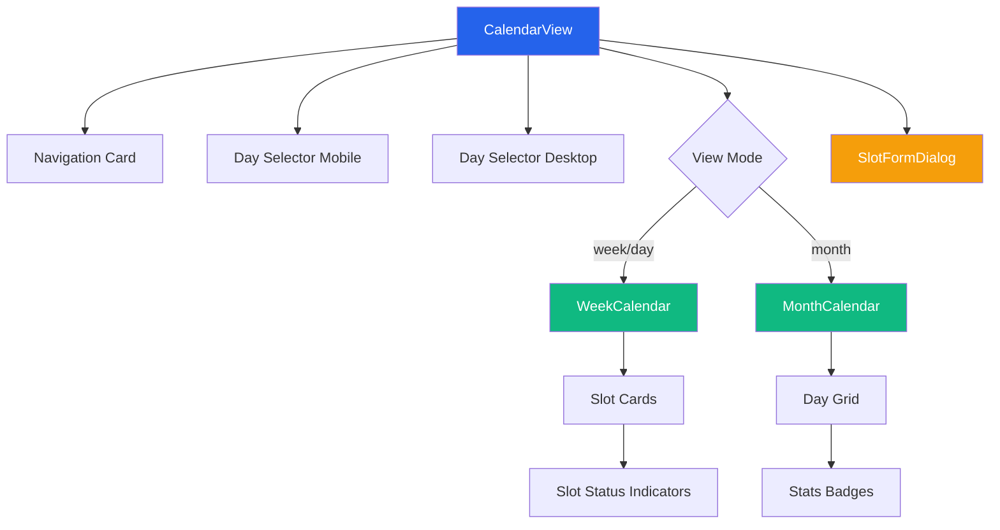
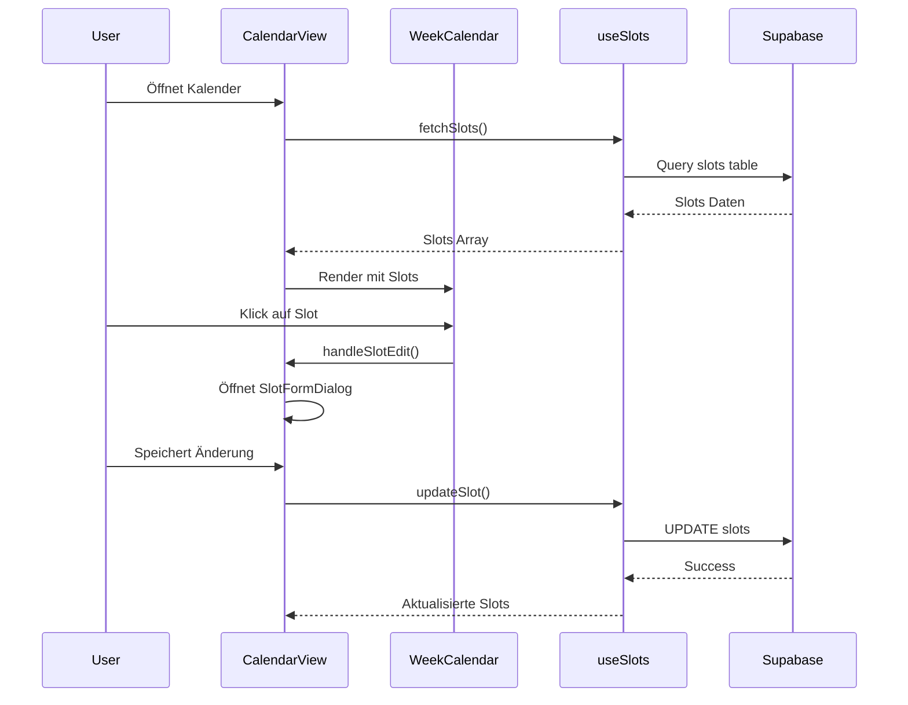
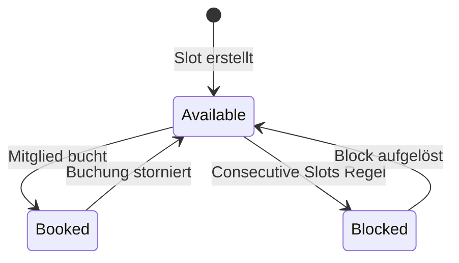
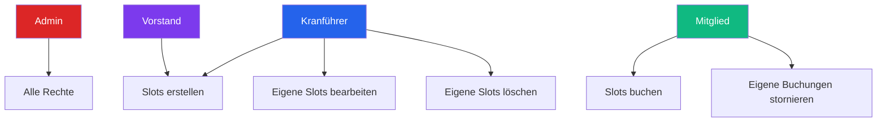
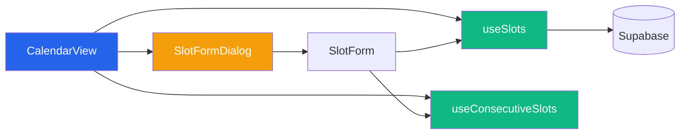

# Krankalender-System - Technische Dokumentation

## Inhaltsverzeichnis
- [Übersicht](#übersicht)
- [Architektur](#architektur)
- [Komponenten](#komponenten)
- [Ansichtsmodi](#ansichtsmodi)
- [Berechtigungssystem](#berechtigungssystem)
- [Technische Details](#technische-details)
- [Integration](#integration)
- [Best Practices](#best-practices)

---

## Übersicht

Das Krankalender-System ist eine vollständige Kalender-Lösung zur Verwaltung und Anzeige von Kranführer-Slots. Es ermöglicht Nutzern das Erstellen, Bearbeiten, Buchen und Verwalten von Zeitslots mit verschiedenen Ansichten und Berechtigungsstufen.

### Hauptfunktionen
- 📅 **3 Ansichtsmodi**: Tag, Woche, Monat
- ⏱️ **15-Minuten-Intervalle**: Unterstützung für Mini-Slots (15, 30, 45, 60 Minuten)
- 👥 **Rollenbasierte Berechtigungen**: Admin, Kranführer, Vorstand, Mitglied
- 🔄 **Echtzeit-Updates**: Live-Synchronisation über Supabase
- 📱 **Responsive Design**: Optimiert für Desktop, Tablet und Mobile

### Systemkontext



---

## Architektur

### Komponenten-Hierarchie



### Datenfluss



---

## Komponenten

### 1. CalendarView

**Pfad**: `src/components/calendar-view.tsx`

**Hauptverantwortung**: Zentrale Steuerungskomponente für alle Kalenderansichten.

#### Kernfunktionen
- View-Mode-Switching (Tag/Woche/Monat)
- Navigation zwischen Zeiträumen
- Dialog-Management für Slot-Erstellung/-Bearbeitung
- Responsive Layout-Anpassungen

#### State Management
```typescript
const [isDialogOpen, setIsDialogOpen] = useState(false);
const [selectedSlot, setSelectedSlot] = useState<Slot | null>(null);
const [prefilledDateTime, setPrefilledDateTime] = useState<{ date: string; time: string } | null>(null);
const [viewMode, setViewMode] = useState<"day" | "week" | "month">("week");
const [selectedDate, setSelectedDate] = useState<Date>(new Date());
const [currentWeek, setCurrentWeek] = useState(startOfWeek(new Date(), { weekStartsOn: 1 }));
const [selectedDay, setSelectedDay] = useState<Date>(new Date());
```

#### Wichtige Event-Handler

**handleSlotEdit**: Öffnet den Dialog für Slot-Bearbeitung
```typescript
const handleSlotEdit = (slot?: Slot, dateTime?: { date: string; time: string }) => {
  if (slot) {
    setSelectedSlot(slot);
    setPrefilledDateTime(null);
  } else if (dateTime) {
    setSelectedSlot(null);
    setPrefilledDateTime(dateTime);
  }
  setIsDialogOpen(true);
};
```

**handleDayClick**: Wechselt von Monatsansicht zu Wochenansicht
```typescript
const handleDayClick = (date: Date) => {
  setSelectedDate(date);
  setViewMode("week");
  setCurrentWeek(startOfWeek(date, { weekStartsOn: 1 }));
};
```

#### Berechtigungsprüfung
```typescript
const canManageSlots = userRole === 'admin' || 
                       userRole === 'kranfuehrer' || 
                       userRole === 'vorstand';
const canBookSlots = !!userRole;
```

#### Responsive Breakpoints
- **Mobile**: < 768px
- **Tablet**: 768px - 1024px
- **Desktop**: > 1024px

---

### 2. WeekCalendar

**Pfad**: `src/components/week-calendar.tsx`

**Hauptverantwortung**: Darstellung von Wochen- und Tagesansicht mit 15-Minuten-Intervallen.

#### Features
- ✅ 15-Minuten-Zeitraster (00:00 - 23:45)
- ✅ Kranführer-Gruppierung
- ✅ Slot-Status-Visualisierung (verfügbar/gebucht/blockiert)
- ✅ Inline-Buchung für Mitglieder
- ✅ Hover-Effekte und Tooltips

#### Zeitgenerierung
```typescript
const times = useMemo(() => {
  const result: string[] = [];
  for (let h = 0; h < 24; h++) {
    for (let m = 0; m < 60; m += 15) {
      result.push(`${h.toString().padStart(2, '0')}:${m.toString().padStart(2, '0')}`);
    }
  }
  return result;
}, []);
```

#### Slot-Rendering-Logik

**Positions-Berechnung**:
```typescript
const getSlotPosition = (slot: Slot) => {
  const [hours, minutes] = slot.time.split(':').map(Number);
  const totalMinutes = hours * 60 + minutes;
  const slotIndex = totalMinutes / 15;
  return slotIndex;
};
```

**Slot-Größe**:
```typescript
const getSlotHeight = (duration: number) => {
  const blocks = duration / 15;
  return `${blocks * 100}%`;
};
```

#### Status-Visualisierung



**Farb-Schema** (definiert in `useSlotDesign`):
- 🟢 **Available**: Grüne Farbtöne
- 🔵 **Booked**: Blaue Farbtöne  
- 🔴 **Blocked**: Rote/Graue Farbtöne

#### Day View vs Week View

**Week View**:
- Zeigt 7 Tage horizontal
- Kompakte Ansicht
- Kranführer als Spalten-Header

**Day View**:
- Fokus auf einen Tag
- Vergrößerte Slot-Karten
- Mehr Details sichtbar

---

### 3. MonthCalendar

**Pfad**: `src/components/month-calendar.tsx`

**Hauptverantwortung**: Monatsübersicht mit Slot-Statistiken pro Tag.

#### Kalender-Grid-Generierung

```typescript
const calendarDays = useMemo(() => {
  const year = currentMonth.getFullYear();
  const month = currentMonth.getMonth();
  
  const firstDay = new Date(year, month, 1);
  const lastDay = new Date(year, month + 1, 0);
  
  const startDate = startOfWeek(firstDay, { weekStartsOn: 1 });
  const endDate = endOfWeek(lastDay, { weekStartsOn: 1 });
  
  const days: Date[] = [];
  let currentDate = startDate;
  
  while (currentDate <= endDate) {
    days.push(new Date(currentDate));
    currentDate = addDays(currentDate, 1);
  }
  
  return days;
}, [currentMonth]);
```

#### Tages-Statistiken

**getDayStats-Funktion**:
```typescript
const getDayStats = (day: Date): DayStats => {
  const dayStr = format(day, 'yyyy-MM-dd');
  const daySlots = slots.filter(slot => slot.date === dayStr);
  
  const stats = {
    totalSlots: daySlots.length,
    bookedSlots: daySlots.filter(s => s.isBooked).length,
    availableSlots: 0,
    blockedSlots: 0
  };
  
  daySlots.forEach(slot => {
    const status = getSlotStatus(slot, slots);
    if (status === 'available') stats.availableSlots++;
    if (status === 'blocked') stats.blockedSlots++;
  });
  
  return stats;
};
```

#### Status-Indikatoren

Jeder Tag zeigt:
- **Gesamt-Slots**: Graues Badge
- **Verfügbar**: Grüner Kreis
- **Gebucht**: Blauer Kreis
- **Blockiert**: Roter Kreis

#### Mobile Summary View

Zusätzliche kompakte Liste für Mobile:
```typescript
<div className="md:hidden space-y-2">
  {daysWithSlots.map(({ date, stats }) => (
    <div key={date} className="p-4 bg-card rounded-lg">
      <div className="font-medium">{format(parseISO(date), 'dd.MM.yyyy')}</div>
      <div className="flex gap-2 mt-2">
        <Badge variant="outline">{stats.totalSlots} Slots</Badge>
        <Badge className="bg-green-500">{stats.availableSlots}</Badge>
        <Badge className="bg-blue-500">{stats.bookedSlots}</Badge>
        <Badge className="bg-red-500">{stats.blockedSlots}</Badge>
      </div>
    </div>
  ))}
</div>
```

---

## Ansichtsmodi

### 1. Tagesansicht (Day View)

**Anwendungsfall**: Detaillierte Ansicht eines einzelnen Tages

**Features**:
- Großzügige Slot-Darstellung
- Alle Details sichtbar
- Einfache Buchung/Bearbeitung
- Ideal für Mobile

**Trigger**: Klick auf Tag-Button in Navigation

---

### 2. Wochenansicht (Week View)

**Anwendungsfall**: Übersicht einer ganzen Woche

**Features**:
- 7-Tage-Überblick
- Horizontal scrollbar bei vielen Kranführern
- Schnelle Navigation
- Standard-Ansicht

**Trigger**: Standard-View beim Laden

---

### 3. Monatsansicht (Month View)

**Anwendungsfall**: Langfristige Planung und Übersicht

**Features**:
- Kalender-Grid mit Statistiken
- Schneller Überblick über Auslastung
- Navigation zwischen Monaten
- Klick auf Tag → Wechsel zu Week View

**Trigger**: Klick auf Monat-Button in Navigation

---

## Berechtigungssystem

### Rollen-Hierarchie



### Berechtigungs-Matrix

| Aktion | Admin | Kranführer | Vorstand | Mitglied |
|--------|-------|------------|----------|----------|
| Slot erstellen | ✅ | ✅ (eigene) | ✅ | ❌ |
| Slot bearbeiten | ✅ | ✅ (eigene) | ❌ | ❌ |
| Slot löschen | ✅ | ✅ (eigene) | ❌ | ❌ |
| Slot buchen | ✅ | ✅ | ✅ | ✅ |
| Buchung stornieren | ✅ | ✅ | ✅ | ✅ (eigene) |
| Slots ansehen | ✅ | ✅ | ✅ | ✅ |

### Implementation

**Beispiel aus CalendarView**:
```typescript
const { userRole } = useRole();

const canManageSlots = userRole === 'admin' || 
                       userRole === 'kranfuehrer' || 
                       userRole === 'vorstand';

const canBookSlots = !!userRole;
```

**Beispiel aus WeekCalendar**:
```typescript
{canManageSlots && !slot.isBooked && (
  <div className="space-y-1">
    <Button
      onClick={() => onSlotEdit(slot)}
      size="sm"
      variant="outline"
    >
      <Edit className="h-3 w-3 mr-1" />
      Bearbeiten
    </Button>
  </div>
)}
```

---

## Technische Details

### Verwendete Hooks

#### 1. useSlots
- **Zweck**: Slot-Datenverwaltung und CRUD-Operationen
- **Details**: Siehe `docs/slot-management-system.md`

#### 2. useConsecutiveSlots
- **Zweck**: Validierung und Verwaltung zusammenhängender Slots
- **Details**: Siehe `docs/slot-management-system.md`

#### 3. useRole
- **Zweck**: Aktuelle Benutzerrolle abrufen
- **Return**: `{ userRole: string, userRoles: string[] }`

#### 4. useStickyHeaderLayout
- **Zweck**: Sticky Header Layout-Einstellungen
- **Return**: `{ isStickyEnabled: boolean }`

### Date Handling

**Bibliothek**: `date-fns`

**Wichtige Funktionen**:
```typescript
import { 
  format,           // Formatierung: '2024-01-15'
  parseISO,         // String → Date
  startOfWeek,      // Wochenbeginn (Montag)
  endOfWeek,        // Wochenende (Sonntag)
  addDays,          // Tage addieren
  isSameDay,        // Tag-Vergleich
  isToday          // Ist heute?
} from 'date-fns';
```

**Beispiel-Verwendung**:
```typescript
// Wochenstart berechnen
const weekStart = startOfWeek(new Date(), { weekStartsOn: 1 });

// Datum formatieren
const dateStr = format(new Date(), 'yyyy-MM-dd');

// 7 Tage generieren
const weekDays = Array.from({ length: 7 }, (_, i) => 
  addDays(weekStart, i)
);
```

### Responsive Design Pattern

```typescript
const isMobile = typeof window !== 'undefined' && window.innerWidth < 768;

{isMobile ? (
  <MobileComponent />
) : (
  <DesktopComponent />
)}
```

### Performance-Optimierungen

**1. useMemo für teure Berechnungen**:
```typescript
const weekSlots = useMemo(() => {
  return slots.filter(slot => {
    const slotDate = parseISO(slot.date);
    return isWithinInterval(slotDate, {
      start: weekStart,
      end: weekEnd
    });
  });
}, [slots, weekStart, weekEnd]);
```

**2. useCallback für Event-Handler**:
```typescript
const handleSlotEdit = useCallback((slot?: Slot) => {
  setSelectedSlot(slot);
  setIsDialogOpen(true);
}, []);
```

**3. Konditionales Rendering**:
```typescript
{viewMode === "week" || viewMode === "day" ? (
  <WeekCalendar {...props} />
) : (
  <MonthCalendar {...props} />
)}
```

---

## Integration

### Mit Slot-Management-System



### Mit Authentifizierung

```typescript
import { useRole } from "@/hooks/use-role";

const { userRole } = useRole();
```

Die Rolle wird verwendet für:
- Berechtigungsprüfungen
- UI-Anpassungen
- Funktions-Freischaltung

### Mit Design-System

```typescript
import { useSlotDesign } from "@/hooks/use-slot-design";

const { settings } = useSlotDesign();
```

Slot-Farben werden als CSS-Variablen gesetzt:
```css
:root {
  --slot-available-bg: ...;
  --slot-available-border: ...;
  --slot-booked-bg: ...;
  /* etc. */
}
```

---

## Best Practices

### 1. Slot-Erstellung

**DO**:
```typescript
// Verwende SlotFormDialog für konsistente UX
<SlotFormDialog
  open={isDialogOpen}
  onOpenChange={setIsDialogOpen}
  prefilledDateTime={{ date: '2024-01-15', time: '10:00' }}
  onClose={handleDialogClose}
/>
```

**DON'T**:
```typescript
// Nicht direkt mit Supabase arbeiten
await supabase.from('slots').insert({ ... });
```

### 2. Datumshandling

**DO**:
```typescript
// Immer date-fns verwenden
const formattedDate = format(new Date(), 'yyyy-MM-dd');
```

**DON'T**:
```typescript
// Keine manuelle String-Manipulation
const date = new Date().toISOString().split('T')[0]; // ❌
```

### 3. State Management

**DO**:
```typescript
// State minimieren, abgeleitete Werte berechnen
const weekSlots = useMemo(() => 
  slots.filter(/* ... */), 
  [slots, weekStart]
);
```

**DON'T**:
```typescript
// Redundanten State vermeiden
const [allSlots, setAllSlots] = useState([]);
const [weekSlots, setWeekSlots] = useState([]); // ❌
```

### 4. Performance

**DO**:
```typescript
// Teure Berechnungen memoizen
const slotsByOperator = useMemo(() => 
  groupSlotsByOperator(slots),
  [slots]
);
```

**DON'T**:
```typescript
// Berechnungen nicht im Render
return (
  <div>
    {groupSlotsByOperator(slots).map(/* ... */)} // ❌
  </div>
);
```

---

## Troubleshooting

### Problem: Slots werden nicht angezeigt

**Lösung**:
1. Prüfe Netzwerk-Tab für Supabase-Queries
2. Überprüfe RLS-Policies in Supabase
3. Checke Konsole für Fehler
4. Verifiziere Datums-Format (`yyyy-MM-dd`)

### Problem: Consecutive Slots blockieren zu viel

**Lösung**:
1. Prüfe `consecutiveSlotsEnabled` Setting
2. Überprüfe Block-Logik in `useConsecutiveSlots`
3. Teste mit Feature ausgeschaltet

### Problem: Navigation funktioniert nicht

**Lösung**:
1. Prüfe `viewMode` State
2. Verifiziere `selectedDate` und `currentWeek` State
3. Checke Event-Handler-Binding

### Problem: Mobile-Ansicht zeigt Desktop-Layout

**Lösung**:
1. Überprüfe Tailwind-Breakpoints (`md:`, `lg:`)
2. Verifiziere `isMobile` Hook-Implementierung
3. Teste verschiedene Bildschirmgrößen

---

## Versionsinformation

**Version**: 2.0.0  
**Letzte Aktualisierung**: Januar 2025  
**Autor**: KSVL Entwicklungsteam

### Änderungshistorie

#### v2.0.0 (Januar 2025)
- ✅ 15-Minuten-Intervalle (Mini-Slots)
- ✅ Tagesansicht hinzugefügt
- ✅ Responsive Mobile-Optimierungen
- ✅ Performance-Verbesserungen mit useMemo

#### v1.5.0 (Dezember 2024)
- Consecutive Slots Feature
- Slot-Block-Verwaltung
- Design-System-Integration

#### v1.0.0 (November 2024)
- Initiales Release
- Wochen- und Monatsansicht
- Grundlegende CRUD-Operationen

---

## Weiterführende Dokumentation

- [Slot-Management-System](./slot-management-system.md)
- [Custom Fields Guide](./custom-fields-guide.md)
- [Supabase RLS-Policies](../supabase/README.md)

---

**Hinweis**: Diese Dokumentation ist ein lebendes Dokument und wird kontinuierlich aktualisiert. Bei Fragen oder Anmerkungen bitte ein Issue im Repository erstellen.