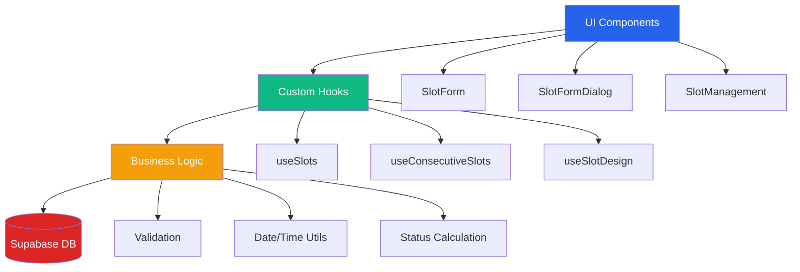
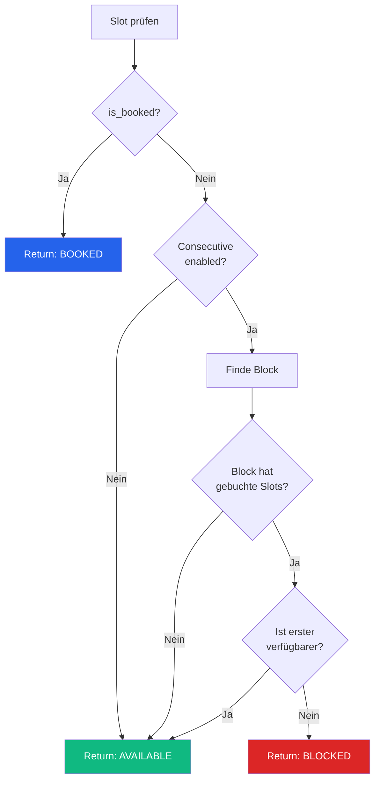
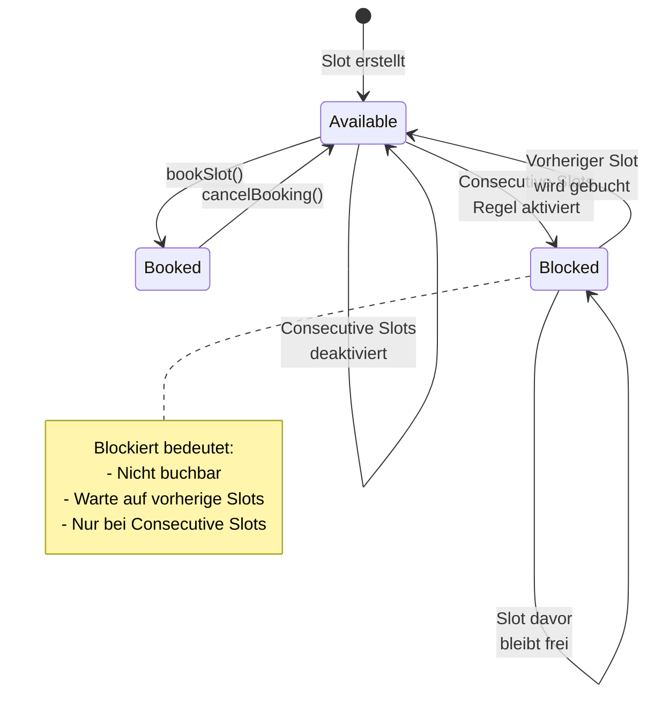

# Slot-Management-System - Technische Dokumentation

## Inhaltsverzeichnis
- [Übersicht](#übersicht)
- [Datenbank-Schema](#datenbank-schema)
- [Hooks & State Management](#hooks--state-management)
- [Slot-Status-System](#slot-status-system)
- [Consecutive Slots Feature](#consecutive-slots-feature)
- [Formulare & Dialoge](#formulare--dialoge)
- [Business Logic](#business-logic)
- [Design-System](#design-system)
- [Best Practices](#best-practices)

---

## Übersicht

Das Slot-Management-System ermöglicht die Verwaltung von Zeitslots für Kranführer. Es unterstützt flexible Buchungen, Mini-Slots (15-Minuten-Intervalle), Slot-Blöcke und ein intelligentes Consecutive-Slots-System.

### Kernfunktionalitäten
- 🕐 **Flexible Zeitslots**: 15, 30, 45 oder 60 Minuten
- 🔗 **Slot-Blöcke**: Mehrere zusammenhängende Slots gleichzeitig erstellen
- 📊 **Status-Management**: Available, Booked, Blocked
- 👤 **Buchungssystem**: Mitglieder können Slots buchen/stornieren
- 🎨 **Anpassbares Design**: Farben und Stile konfigurierbar
- 🔄 **Echtzeit-Sync**: Live-Updates über Supabase Realtime

### System-Übersicht



---

## Datenbank-Schema

### Tabelle: `slots`

**Pfad**: `supabase/migrations/` (automatisch generiert)

#### Spalten-Definition

| Spalte | Typ | Nullable | Default | Beschreibung |
|--------|-----|----------|---------|--------------|
| `id` | uuid | Nein | gen_random_uuid() | Primärschlüssel |
| `date` | date | Nein | - | Slot-Datum (YYYY-MM-DD) |
| `time` | time | Nein | - | Slot-Startzeit (HH:mm) |
| `duration` | integer | Nein | - | Dauer in Minuten (15/30/45/60) |
| `crane_operator_id` | uuid | Nein | - | Referenz zu profiles.id |
| `member_id` | uuid | Ja | NULL | Buchender Nutzer (profiles.id) |
| `is_booked` | boolean | Ja | false | Buchungsstatus |
| `is_mini_slot` | boolean | Ja | false | Ist 15-Min-Mini-Slot |
| `mini_slot_count` | integer | Ja | NULL | Anzahl Mini-Slots (1-4) |
| `start_minute` | integer | Ja | NULL | Start-Minute (0/15/30/45) |
| `block_id` | uuid | Ja | NULL | Gruppen-ID für Slot-Blöcke |
| `notes` | text | Ja | NULL | Zusätzliche Notizen |
| `is_test_data` | boolean | Ja | false | Markierung für Testdaten |
| `created_at` | timestamp | Ja | now() | Erstellungszeitpunkt |
| `updated_at` | timestamp | Ja | now() | Aktualisierungszeitpunkt |

#### Indizes

```sql
CREATE INDEX idx_slots_date ON slots(date);
CREATE INDEX idx_slots_crane_operator ON slots(crane_operator_id);
CREATE INDEX idx_slots_member ON slots(member_id);
CREATE INDEX idx_slots_block ON slots(block_id);
```

#### Row Level Security (RLS) Policies

**1. Everyone can view slots**
```sql
CREATE POLICY "Everyone can view slots"
ON slots FOR SELECT
USING (true);
```

**2. Crane operators, vorstand and admins can create slots**
```sql
CREATE POLICY "Crane operators, vorstand and admins can create slots"
ON slots FOR INSERT
WITH CHECK (
  has_role(auth.uid(), 'admin'::app_role) OR 
  has_role(auth.uid(), 'kranfuehrer'::app_role) OR 
  has_role(auth.uid(), 'vorstand'::app_role)
);
```

**3. Crane operators and admins can update slots**
```sql
CREATE POLICY "Crane operators and admins can update slots"
ON slots FOR UPDATE
USING (
  has_role(auth.uid(), 'admin'::app_role) OR 
  (has_role(auth.uid(), 'kranfuehrer'::app_role) AND crane_operator_id = auth.uid())
);
```

**4. Members can book slots**
```sql
CREATE POLICY "Members can book slots"
ON slots FOR UPDATE
USING (NOT is_booked AND auth.uid() IS NOT NULL)
WITH CHECK (member_id = auth.uid() AND is_booked = true);
```

**5. Members can update their own booked slots**
```sql
CREATE POLICY "Members can update their own booked slots"
ON slots FOR UPDATE
USING (is_booked = true AND member_id = auth.uid())
WITH CHECK (member_id = auth.uid());
```

**6. Admins can delete slots**
```sql
CREATE POLICY "Admins can delete slots"
ON slots FOR DELETE
USING (has_role(auth.uid(), 'admin'::app_role));
```

#### Trigger: Auto-Update Timestamp

```sql
CREATE TRIGGER update_slots_updated_at
BEFORE UPDATE ON slots
FOR EACH ROW
EXECUTE FUNCTION update_updated_at_column();
```

---

## Hooks & State Management

### 1. useSlots

**Pfad**: `src/hooks/use-slots.tsx`

**Zweck**: Zentrale Datenverwaltung für alle Slot-Operationen.

#### Interface: CreateSlotData

```typescript
interface CreateSlotData {
  date: string;           // ISO-Format: 'YYYY-MM-DD'
  time: string;           // Format: 'HH:mm'
  duration: 15 | 30 | 45 | 60;
  craneOperatorId: string;
  notes?: string;
  isMiniSlot?: boolean;
  miniSlotCount?: number; // 1-4
  blockId?: string;
}
```

#### Funktionen

**fetchSlots()**
```typescript
const fetchSlots = async (): Promise<void>
```
- Lädt alle Slots aus der Datenbank
- Joined mit `profiles` für Kranführer- und Mitglieds-Details
- Transformiert DB-Daten in Frontend-Format
- Setzt `isLoading` State

**Implementierung**:
```typescript
const { data, error } = await supabase
  .from('slots')
  .select(`
    *,
    crane_operator:profiles!slots_crane_operator_id_fkey(id, name, email),
    booked_member:profiles!slots_member_id_fkey(id, name, email, member_number)
  `)
  .order('date', { ascending: true })
  .order('time', { ascending: true });
```

**addSlot(slotData: CreateSlotData)**
```typescript
const addSlot = async (slotData: CreateSlotData): Promise<void>
```
- Erstellt einen einzelnen Slot
- Validiert Zeitüberschneidungen
- Aktualisiert lokalen State optimistisch

**addSlotBlock(slotsData: CreateSlotData[])**
```typescript
const addSlotBlock = async (slotsData: CreateSlotData[]): Promise<void>
```
- Erstellt mehrere Slots gleichzeitig
- Generiert gemeinsame `block_id`
- Transaktionale Ausführung

**updateSlot(id: string, updates: Partial<CreateSlotData> & {...})**
```typescript
const updateSlot = async (
  id: string, 
  updates: Partial<CreateSlotData> & { 
    memberId?: string; 
    memberName?: string 
  }
): Promise<void>
```
- Aktualisiert bestehenden Slot
- Unterstützt Partial Updates
- Optimistische UI-Updates

**deleteSlot(id: string)**
```typescript
const deleteSlot = async (id: string): Promise<void>
```
- Löscht Slot aus DB
- Entfernt aus lokalem State
- Toast-Benachrichtigung

**bookSlot(slotId: string, memberId: string)**
```typescript
const bookSlot = async (slotId: string, memberId: string): Promise<void>
```
- Bucht Slot für Mitglied
- Setzt `is_booked = true`
- Setzt `member_id`

**cancelBooking(slotId: string)**
```typescript
const cancelBooking = async (slotId: string): Promise<void>
```
- Storniert Buchung
- Setzt `is_booked = false`
- Entfernt `member_id`

#### Realtime-Subscription

```typescript
useEffect(() => {
  const channel = supabase
    .channel('slots_changes')
    .on(
      'postgres_changes',
      {
        event: '*',
        schema: 'public',
        table: 'slots'
      },
      () => {
        // Debounced refetch
        if (refetchTimeoutRef.current) {
          clearTimeout(refetchTimeoutRef.current);
        }
        refetchTimeoutRef.current = setTimeout(() => {
          fetchSlots();
        }, 500);
      }
    )
    .subscribe();

  return () => {
    supabase.removeChannel(channel);
  };
}, []);
```

**Debouncing**: Verhindert zu häufige Refetches bei schnellen Änderungen.

---

### 2. useConsecutiveSlots

**Pfad**: `src/hooks/use-consecutive-slots.tsx`

**Zweck**: Verwaltung und Validierung der Consecutive-Slots-Logik.

#### Context-Typ

```typescript
interface ConsecutiveSlotsContextType {
  consecutiveSlotsEnabled: boolean;
  setConsecutiveSlotsEnabled: (enabled: boolean) => void;
  validateConsecutiveSlots: (
    newSlot: { date: string; time: string; duration: number; craneOperatorId: string },
    existingSlots: Slot[],
    excludeSlotId?: string
  ) => { isValid: boolean; message?: string };
  getSlotBlocks: (slots: Slot[]) => Slot[][];
  getSlotStatus: (slot: Slot, allSlots: Slot[]) => SlotStatus;
  isSlotBookable: (slot: Slot, allSlots: Slot[]) => boolean;
}
```

#### Kernfunktionen

**getSlotBlocks(slots: Slot[]): Slot[][]**

Gruppiert Slots zu Blöcken:
- Gleicher Kranführer
- Gleiches Datum
- Zeitlich aufeinanderfolgend

```typescript
const getSlotBlocks = useMemo(() => {
  return (slots: Slot[]): Slot[][] => {
    // Gruppiere nach Kranführer + Datum
    const groups = new Map<string, Slot[]>();
    
    slots.forEach(slot => {
      const key = `${slot.craneOperator.id}-${slot.date}`;
      if (!groups.has(key)) {
        groups.set(key, []);
      }
      groups.get(key)!.push(slot);
    });
    
    // Sortiere nach Zeit und bilde Blöcke
    const blocks: Slot[][] = [];
    groups.forEach(groupSlots => {
      const sorted = groupSlots.sort((a, b) => 
        a.time.localeCompare(b.time)
      );
      
      let currentBlock: Slot[] = [sorted[0]];
      
      for (let i = 1; i < sorted.length; i++) {
        const prevSlot = sorted[i - 1];
        const currSlot = sorted[i];
        
        const prevEnd = calculateSlotEnd(prevSlot.time, prevSlot.duration);
        
        if (currSlot.time === prevEnd) {
          currentBlock.push(currSlot);
        } else {
          blocks.push(currentBlock);
          currentBlock = [currSlot];
        }
      }
      blocks.push(currentBlock);
    });
    
    return blocks;
  };
}, []);
```

**getSlotStatus(slot: Slot, allSlots: Slot[]): SlotStatus**

Ermittelt Status eines Slots:



**Implementierung**:
```typescript
const getSlotStatus = useCallback((slot: Slot, allSlots: Slot[]): SlotStatus => {
  if (slot.isBooked) return 'booked';
  
  if (!consecutiveSlotsEnabled) return 'available';
  
  const blocks = getSlotBlocks(allSlots);
  const block = blocks.find(b => b.some(s => s.id === slot.id));
  
  if (!block) return 'available';
  
  const hasBookedSlots = block.some(s => s.isBooked);
  if (!hasBookedSlots) return 'available';
  
  const firstAvailableIndex = block.findIndex(s => !s.isBooked);
  const slotIndex = block.findIndex(s => s.id === slot.id);
  
  return slotIndex === firstAvailableIndex ? 'available' : 'blocked';
}, [consecutiveSlotsEnabled, getSlotBlocks]);
```

**validateConsecutiveSlots()**

Validiert, ob ein neuer/geänderter Slot erlaubt ist:

```typescript
const validateConsecutiveSlots = useCallback((
  newSlot: { date: string; time: string; duration: number; craneOperatorId: string },
  existingSlots: Slot[],
  excludeSlotId?: string
): { isValid: boolean; message?: string } => {
  if (!consecutiveSlotsEnabled) {
    return { isValid: true };
  }
  
  // Filtere Slots des gleichen Kranführers am gleichen Tag
  const relevantSlots = existingSlots.filter(s => 
    s.craneOperator.id === newSlot.craneOperatorId &&
    s.date === newSlot.date &&
    s.id !== excludeSlotId
  );
  
  if (relevantSlots.length === 0) {
    return { isValid: true };
  }
  
  // Prüfe, ob Slot in Block passt oder eigenständig ist
  const blocks = getSlotBlocks([...relevantSlots, newSlotAsSlot]);
  const newSlotBlock = blocks.find(b => 
    b.some(s => s.id === 'temp-new-slot')
  );
  
  if (!newSlotBlock) return { isValid: true };
  
  // Prüfe auf Lücken im Block
  const hasGap = checkForGapsInBlock(newSlotBlock);
  
  if (hasGap) {
    return {
      isValid: false,
      message: "Dieser Slot würde eine Lücke im Block erzeugen."
    };
  }
  
  return { isValid: true };
}, [consecutiveSlotsEnabled, getSlotBlocks]);
```

---

### 3. useSlotDesign

**Pfad**: `src/hooks/use-slot-design.tsx`

**Zweck**: Verwaltung der visuellen Darstellung von Slots.

#### SlotDesignSettings Interface

```typescript
interface SlotDesignSettings {
  available: {
    background: string;    // HSL-Wert
    border: string;        // HSL-Wert
    text: string;          // HSL-Wert
    label: string;         // Anzeigetext
  };
  booked: {
    background: string;
    border: string;
    text: string;
    label: string;
  };
  blocked: {
    background: string;
    border: string;
    text: string;
    label: string;
  };
}
```

#### Default Design

```typescript
const DEFAULT_TRENDY_DESIGN: SlotDesignSettings = {
  available: {
    background: "142 76% 36%",     // Grün
    border: "142 71% 45%",
    text: "0 0% 100%",
    label: "Verfügbar"
  },
  booked: {
    background: "221 83% 53%",     // Blau
    border: "217 91% 60%",
    text: "0 0% 100%",
    label: "Gebucht"
  },
  blocked: {
    background: "0 84% 60%",       // Rot
    border: "0 72% 51%",
    text: "0 0% 100%",
    label: "Blockiert"
  }
};
```

#### CSS Custom Properties

```typescript
useEffect(() => {
  const root = document.documentElement;
  
  // Available Slots
  root.style.setProperty('--slot-available-bg', settings.available.background);
  root.style.setProperty('--slot-available-border', settings.available.border);
  root.style.setProperty('--slot-available-text', settings.available.text);
  
  // Booked Slots
  root.style.setProperty('--slot-booked-bg', settings.booked.background);
  root.style.setProperty('--slot-booked-border', settings.booked.border);
  root.style.setProperty('--slot-booked-text', settings.booked.text);
  
  // Blocked Slots
  root.style.setProperty('--slot-blocked-bg', settings.blocked.background);
  root.style.setProperty('--slot-blocked-border', settings.blocked.border);
  root.style.setProperty('--slot-blocked-text', settings.blocked.text);
}, [settings]);
```

#### Funktionen

**saveSettings(newSettings: Partial<SlotDesignSettings>)**
```typescript
const saveSettings = async (newSettings: Partial<SlotDesignSettings>) => {
  const updated = { ...designState.slotDesign, ...newSettings };
  await saveAppSetting('slotDesign', updated);
};
```

**updateSlotType(slotType, colorType, color)**
```typescript
const updateSlotType = async (
  slotType: 'available' | 'booked' | 'blocked',
  colorType: 'background' | 'border' | 'text',
  color: string
) => {
  const updated = {
    ...designState.slotDesign,
    [slotType]: {
      ...designState.slotDesign[slotType],
      [colorType]: color
    }
  };
  await saveAppSetting('slotDesign', updated);
};
```

**resetToDefaults()**
```typescript
const resetToDefaults = async () => {
  await saveAppSetting('slotDesign', DEFAULT_TRENDY_DESIGN);
};
```

---

## Slot-Status-System

### Status-Definitionen

```typescript
type SlotStatus = 'available' | 'booked' | 'blocked';
```

#### 1. AVAILABLE (Verfügbar)

**Bedingungen**:
- `is_booked = false`
- Entweder: Consecutive Slots deaktiviert
- Oder: Erster verfügbarer Slot im Block

**Darstellung**:
- Grüner Hintergrund
- "Buchen"-Button sichtbar
- Kranführer-Name angezeigt

---

#### 2. BOOKED (Gebucht)

**Bedingungen**:
- `is_booked = true`
- `member_id` ist gesetzt

**Darstellung**:
- Blauer Hintergrund
- Mitglieds-Name angezeigt
- "Stornieren"-Button (für eigene Buchungen)

---

#### 3. BLOCKED (Blockiert)

**Bedingungen**:
- `is_booked = false`
- Consecutive Slots aktiviert
- Nicht erster verfügbarer Slot im Block

**Darstellung**:
- Roter/Grauer Hintergrund
- Gesperrt-Icon
- Keine Interaktion möglich

---

### Status-Übergänge



---

## Consecutive Slots Feature

### Konzept

**Ziel**: Verhindern von "Lücken" in Slot-Blöcken, sodass Buchungen immer zusammenhängend erfolgen müssen.

**Beispiel**:

❌ **Ohne Consecutive Slots**:
```
10:00 - Slot 1 - Frei
10:30 - Slot 2 - GEBUCHT
11:00 - Slot 3 - Frei  ← Kann gebucht werden (Lücke!)
11:30 - Slot 4 - Frei
```

✅ **Mit Consecutive Slots**:
```
10:00 - Slot 1 - Frei  ← MUSS zuerst gebucht werden
10:30 - Slot 2 - GEBUCHT
11:00 - Slot 3 - BLOCKIERT
11:30 - Slot 4 - BLOCKIERT
```

### Block-Bildung

**Kriterien**:
1. Gleicher Kranführer (`crane_operator_id`)
2. Gleiches Datum (`date`)
3. Zeitlich aufeinanderfolgend (keine Zeitlücken)

**Beispiel-Block**:
```typescript
{
  craneOperatorId: "abc-123",
  date: "2024-01-15",
  slots: [
    { time: "10:00", duration: 30 },
    { time: "10:30", duration: 30 },
    { time: "11:00", duration: 60 }
    // 12:00 - Lücke → Neuer Block beginnt
  ]
}
```

### Regelwerk

#### Regel 1: Erster Slot immer verfügbar
```typescript
if (!block.some(s => s.isBooked)) {
  return 'available'; // Ganzer Block ist leer
}
```

#### Regel 2: Nur erster freier Slot buchbar
```typescript
const firstAvailableIndex = block.findIndex(s => !s.isBooked);
const slotIndex = block.findIndex(s => s.id === slot.id);

if (slotIndex === firstAvailableIndex) {
  return 'available';
} else {
  return 'blocked';
}
```

#### Regel 3: Neue Slots dürfen keine Lücken erzeugen
```typescript
const validateConsecutiveSlots = (newSlot, existingSlots) => {
  // Simuliere Block mit neuem Slot
  const simulatedBlock = [...existingSlots, newSlot].sort(byTime);
  
  // Prüfe auf Zeitlücken
  for (let i = 0; i < simulatedBlock.length - 1; i++) {
    const currentEnd = calculateSlotEnd(
      simulatedBlock[i].time,
      simulatedBlock[i].duration
    );
    const nextStart = simulatedBlock[i + 1].time;
    
    if (currentEnd !== nextStart) {
      return { isValid: false, message: "Erzeugt Lücke im Block" };
    }
  }
  
  return { isValid: true };
};
```

### UI-Indikatoren

**Blockierter Slot**:
```tsx
{status === 'blocked' && (
  <div className="flex items-center gap-2 text-destructive">
    <Lock className="h-4 w-4" />
    <span>Blockiert - Vorherige Slots müssen zuerst gebucht werden</span>
  </div>
)}
```

**Tooltip**:
```tsx
<TooltipContent>
  <p>Dieser Slot ist blockiert.</p>
  <p className="text-xs mt-1">
    Grund: Consecutive Slots aktiviert. 
    Buchen Sie zuerst frühere Slots in diesem Block.
  </p>
</TooltipContent>
```

---

## Formulare & Dialoge

### SlotForm

**Pfad**: `src/components/common/slot-form.tsx`

**Zweck**: Hauptformular für Slot-Erstellung und -Bearbeitung.

#### Form-Felder

**1. Datum** (Calendar Picker)
```tsx
<FormField
  control={form.control}
  name="date"
  render={({ field }) => (
    <FormItem>
      <FormLabel>Datum *</FormLabel>
      <Popover>
        <PopoverTrigger asChild>
          <Button variant="outline">
            <CalendarIcon className="mr-2 h-4 w-4" />
            {field.value ? format(field.value, 'dd.MM.yyyy') : "Datum wählen"}
          </Button>
        </PopoverTrigger>
        <PopoverContent>
          <Calendar
            mode="single"
            selected={field.value}
            onSelect={field.onChange}
            disabled={(date) => date < new Date()}
          />
        </PopoverContent>
      </Popover>
    </FormItem>
  )}
/>
```

**2. Uhrzeit** (Time Picker - 15-Min-Intervalle)
```tsx
<FormField
  control={form.control}
  name="time"
  render={({ field }) => (
    <FormItem>
      <FormLabel>Uhrzeit *</FormLabel>
      <Select onValueChange={field.onChange} value={field.value}>
        <SelectTrigger>
          <SelectValue placeholder="Zeit wählen" />
        </SelectTrigger>
        <SelectContent>
          {generateMiniTimeSlots().map(time => (
            <SelectItem key={time} value={time}>
              {time}
            </SelectItem>
          ))}
        </SelectContent>
      </Select>
    </FormItem>
  )}
/>
```

**3. Dauer** (Radio Group)
```tsx
<FormField
  control={form.control}
  name="duration"
  render={({ field }) => (
    <FormItem>
      <FormLabel>Dauer *</FormLabel>
      <RadioGroup
        onValueChange={(value) => field.onChange(Number(value))}
        value={field.value?.toString()}
      >
        <FormItem>
          <RadioGroupItem value="15" id="15" />
          <FormLabel htmlFor="15">15 Minuten</FormLabel>
        </FormItem>
        <FormItem>
          <RadioGroupItem value="30" id="30" />
          <FormLabel htmlFor="30">30 Minuten</FormLabel>
        </FormItem>
        <FormItem>
          <RadioGroupItem value="45" id="45" />
          <FormLabel htmlFor="45">45 Minuten</FormLabel>
        </FormItem>
        <FormItem>
          <RadioGroupItem value="60" id="60" />
          <FormLabel htmlFor="60">60 Minuten</FormLabel>
        </FormItem>
      </RadioGroup>
    </FormItem>
  )}
/>
```

**4. Kranführer** (Searchable Select)
```tsx
<FormField
  control={form.control}
  name="craneOperatorId"
  render={({ field }) => (
    <FormItem>
      <FormLabel>Kranführer *</FormLabel>
      <Select onValueChange={field.onChange} value={field.value}>
        <SelectTrigger>
          <SelectValue placeholder="Kranführer wählen" />
        </SelectTrigger>
        <SelectContent>
          {craneOperators.map(op => (
            <SelectItem key={op.id} value={op.id}>
              {op.name}
            </SelectItem>
          ))}
        </SelectContent>
      </Select>
    </FormItem>
  )}
/>
```

**5. Slot-Block** (Optional)
```tsx
<FormField
  control={form.control}
  name="isSlotBlock"
  render={({ field }) => (
    <FormItem className="flex items-center gap-2">
      <Switch
        checked={field.value}
        onCheckedChange={field.onChange}
      />
      <FormLabel>Mehrere Slots (Block) erstellen</FormLabel>
    </FormItem>
  )}
/>

{isSlotBlock && (
  <FormField
    control={form.control}
    name="slotCount"
    render={({ field }) => (
      <FormItem>
        <FormLabel>Anzahl Slots</FormLabel>
        <Input
          type="number"
          min={2}
          max={20}
          {...field}
        />
      </FormItem>
    )}
  />
)}
```

#### Validierung

**Zod-Schema**:
```typescript
const formSchema = z.object({
  date: z.date({
    required_error: "Bitte wählen Sie ein Datum",
  }),
  time: z.string().regex(/^([0-1][0-9]|2[0-3]):[0-5][0-9]$/, "Ungültige Zeit"),
  duration: z.enum(['15', '30', '45', '60']),
  craneOperatorId: z.string().min(1, "Bitte wählen Sie einen Kranführer"),
  notes: z.string().optional(),
  isSlotBlock: z.boolean().default(false),
  slotCount: z.number().min(2).max(20).optional(),
});
```

**Custom Validierung**:
```typescript
const onSubmit = async (data: SlotFormData) => {
  // Zeitüberschneidung prüfen
  const isValid = validateSlotTime(
    data.date,
    data.time,
    data.duration,
    data.craneOperatorId,
    existingSlots,
    editingSlot?.id
  );
  
  if (!isValid) {
    toast.error("Zeitslot überschneidet sich mit bestehendem Slot");
    return;
  }
  
  // Consecutive Slots Validierung
  if (consecutiveSlotsEnabled) {
    const { isValid, message } = validateConsecutiveSlots(
      data,
      existingSlots,
      editingSlot?.id
    );
    
    if (!isValid) {
      toast.error(message);
      return;
    }
  }
  
  // Submit
  await handleSubmit(data);
};
```

---

### SlotFormDialog

**Pfad**: `src/components/slot-form-dialog.tsx`

**Zweck**: Dialog-Wrapper für SlotForm mit Modal-Funktionalität.

#### Props

```typescript
interface SlotFormDialogProps {
  open: boolean;
  onOpenChange: (open: boolean) => void;
  slot?: Slot | null;
  onSave?: (slotData: SlotFormData, slotId?: string) => void;
  defaultDate?: string;
  defaultTime?: string;
  prefilledDateTime?: { date: string; time: string } | null;
  onClose: (navigateToDate?: Date) => void;
}
```

#### Implementation

```tsx
<Dialog open={open} onOpenChange={onOpenChange}>
  <DialogContent className="max-w-2xl max-h-[90vh] overflow-y-auto">
    <DialogHeader>
      <DialogTitle>
        {slot ? 'Slot bearbeiten' : 'Neuer Slot'}
      </DialogTitle>
      <DialogDescription>
        {slot 
          ? 'Bearbeiten Sie die Details des Slots' 
          : 'Erstellen Sie einen neuen Zeitslot'}
      </DialogDescription>
    </DialogHeader>
    
    <SlotForm
      slot={slot}
      onSave={handleSave}
      onCancel={() => onOpenChange(false)}
      prefilledDateTime={prefilledDateTime}
    />
  </DialogContent>
</Dialog>
```

---

## Business Logic

**Pfad**: `src/lib/business-logic.ts`

### Zeit-Utilities

**generateMiniTimeSlots()**
```typescript
export const generateMiniTimeSlots = (): string[] => {
  const slots: string[] = [];
  for (let hour = 0; hour < 24; hour++) {
    for (let minute = 0; minute < 60; minute += 15) {
      const h = hour.toString().padStart(2, '0');
      const m = minute.toString().padStart(2, '0');
      slots.push(`${h}:${m}`);
    }
  }
  return slots;
};
// Returns: ['00:00', '00:15', '00:30', ..., '23:45']
```

**calculateSlotEnd(time: string, duration: number)**
```typescript
export const calculateSlotEnd = (time: string, duration: number): string => {
  const [hours, minutes] = time.split(':').map(Number);
  const totalMinutes = hours * 60 + minutes + duration;
  
  const endHours = Math.floor(totalMinutes / 60) % 24;
  const endMinutes = totalMinutes % 60;
  
  return `${endHours.toString().padStart(2, '0')}:${endMinutes.toString().padStart(2, '0')}`;
};
// Example: calculateSlotEnd('10:30', 45) → '11:15'
```

**timeToMinutes(time: string)**
```typescript
export const timeToMinutes = (time: string): number => {
  const [hours, minutes] = time.split(':').map(Number);
  return hours * 60 + minutes;
};
// Example: timeToMinutes('10:30') → 630
```

### Validierungs-Utilities

**validateSlotTime()**
```typescript
export const validateSlotTime = (
  date: string,
  time: string,
  duration: number,
  craneOperatorId: string,
  existingSlots: Slot[],
  excludeSlotId?: string
): boolean => {
  const newSlotStart = timeToMinutes(time);
  const newSlotEnd = newSlotStart + duration;
  
  const conflicts = existingSlots.filter(slot => {
    if (slot.id === excludeSlotId) return false;
    if (slot.date !== date) return false;
    if (slot.craneOperator.id !== craneOperatorId) return false;
    
    const slotStart = timeToMinutes(slot.time);
    const slotEnd = slotStart + slot.duration;
    
    // Prüfe Überschneidung
    return (
      (newSlotStart >= slotStart && newSlotStart < slotEnd) ||
      (newSlotEnd > slotStart && newSlotEnd <= slotEnd) ||
      (newSlotStart <= slotStart && newSlotEnd >= slotEnd)
    );
  });
  
  return conflicts.length === 0;
};
```

**isTimeInPast(date: string, time: string)**
```typescript
export const isTimeInPast = (date: string, time: string): boolean => {
  const [hours, minutes] = time.split(':').map(Number);
  const slotDateTime = new Date(date);
  slotDateTime.setHours(hours, minutes, 0, 0);
  
  return slotDateTime < new Date();
};
```

### Slot-Utilities

**getSlotStatusLabel(status: SlotStatus)**
```typescript
export const getSlotStatusLabel = (status: SlotStatus): string => {
  const labels: Record<SlotStatus, string> = {
    available: 'Verfügbar',
    booked: 'Gebucht',
    blocked: 'Blockiert'
  };
  return labels[status];
};
```

**groupSlotsByDate(slots: Slot[])**
```typescript
export const groupSlotsByDate = (slots: Slot[]): Map<string, Slot[]> => {
  const groups = new Map<string, Slot[]>();
  
  slots.forEach(slot => {
    if (!groups.has(slot.date)) {
      groups.set(slot.date, []);
    }
    groups.get(slot.date)!.push(slot);
  });
  
  return groups;
};
```

**sortSlotsByDateTime(slots: Slot[])**
```typescript
export const sortSlotsByDateTime = (slots: Slot[]): Slot[] => {
  return [...slots].sort((a, b) => {
    const dateCompare = a.date.localeCompare(b.date);
    if (dateCompare !== 0) return dateCompare;
    return a.time.localeCompare(b.time);
  });
};
```

---

## Design-System

### CSS Custom Properties

**Definiert in**: `src/index.css` (dynamisch über `useSlotDesign`)

```css
:root {
  /* Available Slots */
  --slot-available-bg: 142 76% 36%;
  --slot-available-border: 142 71% 45%;
  --slot-available-text: 0 0% 100%;
  
  /* Booked Slots */
  --slot-booked-bg: 221 83% 53%;
  --slot-booked-border: 217 91% 60%;
  --slot-booked-text: 0 0% 100%;
  
  /* Blocked Slots */
  --slot-blocked-bg: 0 84% 60%;
  --slot-blocked-border: 0 72% 51%;
  --slot-blocked-text: 0 0% 100%;
}
```

### Tailwind-Klassen

**Verwendung in Komponenten**:
```tsx
// Available Slot
<div className="bg-[hsl(var(--slot-available-bg))] border-[hsl(var(--slot-available-border))] text-[hsl(var(--slot-available-text))]">
  Verfügbar
</div>

// Booked Slot
<div className="bg-[hsl(var(--slot-booked-bg))] border-[hsl(var(--slot-booked-border))] text-[hsl(var(--slot-booked-text))]">
  Gebucht
</div>

// Blocked Slot
<div className="bg-[hsl(var(--slot-blocked-bg))] border-[hsl(var(--slot-blocked-border))] text-[hsl(var(--slot-blocked-text))]">
  Blockiert
</div>
```

---

## Best Practices

### 1. Slot-Erstellung

**DO**:
```typescript
// Verwende useSlots Hook
const { addSlot, addSlotBlock } = useSlots();

// Einzelner Slot
await addSlot({
  date: '2024-01-15',
  time: '10:00',
  duration: 30,
  craneOperatorId: 'abc-123'
});

// Slot-Block
await addSlotBlock([
  { date: '2024-01-15', time: '10:00', duration: 30, craneOperatorId: 'abc-123' },
  { date: '2024-01-15', time: '10:30', duration: 30, craneOperatorId: 'abc-123' },
  { date: '2024-01-15', time: '11:00', duration: 30, craneOperatorId: 'abc-123' }
]);
```

**DON'T**:
```typescript
// Nicht direkt mit Supabase arbeiten
await supabase.from('slots').insert({ ... }); // ❌
```

### 2. Status-Prüfung

**DO**:
```typescript
const { getSlotStatus } = useConsecutiveSlots();
const status = getSlotStatus(slot, allSlots);

if (status === 'available') {
  // Buchung erlauben
}
```

**DON'T**:
```typescript
// Status nicht manuell berechnen
if (!slot.isBooked && !hasBookedBefore) { // ❌
  // Fehleranfällig
}
```

### 3. Validierung

**DO**:
```typescript
// Nutze Business Logic Utilities
import { validateSlotTime, isTimeInPast } from '@/lib/business-logic';

const isValid = validateSlotTime(date, time, duration, operatorId, slots);
const isPast = isTimeInPast(date, time);
```

**DON'T**:
```typescript
// Keine manuelle Validierung
const overlaps = slots.some(s => /* komplexe Logik */); // ❌
```

### 4. Performance

**DO**:
```typescript
// Memoize teure Berechnungen
const slotBlocks = useMemo(
  () => getSlotBlocks(slots),
  [slots]
);
```

**DON'T**:
```typescript
// Berechnungen nicht im Render
return slots.map(slot => {
  const status = calculateStatus(slot); // ❌ Bei jedem Render
  return <SlotCard status={status} />;
});
```

---

## Troubleshooting

### Problem: Slots werden nicht aktualisiert

**Ursachen**:
- Realtime-Subscription nicht aktiv
- RLS-Policies blockieren Zugriff
- Netzwerk-Fehler

**Lösung**:
```typescript
// 1. Prüfe Subscription
useEffect(() => {
  console.log('Subscription Status:', channel?.state);
}, [channel]);

// 2. Manuelle Refetch
const { fetchSlots } = useSlots();
await fetchSlots();

// 3. Prüfe Netzwerk-Tab
```

### Problem: Consecutive Slots blockieren falsch

**Ursachen**:
- Block-Bildung fehlerhaft
- Status-Berechnung inkorrekt
- Feature fälschlicherweise aktiviert

**Lösung**:
```typescript
// 1. Prüfe Setting
const { consecutiveSlotsEnabled } = useConsecutiveSlots();
console.log('Consecutive Slots:', consecutiveSlotsEnabled);

// 2. Debugge Block-Bildung
const blocks = getSlotBlocks(slots);
console.log('Blocks:', blocks);

// 3. Deaktiviere temporär
setConsecutiveSlotsEnabled(false);
```

### Problem: Validierung schlägt fehl

**Ursachen**:
- Zeitformat inkorrekt
- Datumsformat inkorrekt
- Kranführer-ID fehlt

**Lösung**:
```typescript
// 1. Prüfe Formate
console.log('Date:', date); // Sollte 'YYYY-MM-DD' sein
console.log('Time:', time); // Sollte 'HH:mm' sein

// 2. Validiere Eingaben
const isValidTime = /^([0-1][0-9]|2[0-3]):[0-5][0-9]$/.test(time);
const isValidDate = /^\d{4}-\d{2}-\d{2}$/.test(date);

// 3. Prüfe Kranführer
console.log('Operator ID:', craneOperatorId);
```

---

## Versionsinformation

**Version**: 2.0.0  
**Letzte Aktualisierung**: Januar 2025  
**Autor**: KSVL Entwicklungsteam

### Änderungshistorie

#### v2.0.0 (Januar 2025)
- ✅ Mini-Slots (15-Minuten-Intervalle)
- ✅ Slot-Design-System
- ✅ Verbesserte Validierung
- ✅ Performance-Optimierungen

#### v1.5.0 (Dezember 2024)
- Consecutive Slots Feature
- Block-Verwaltung
- Status-System erweitert

#### v1.0.0 (November 2024)
- Initiales Release
- Basis-CRUD-Operationen
- Einfaches Buchungssystem

---

## Weiterführende Dokumentation

- [Krankalender-System](./krankalender-system.md)
- [Custom Fields Guide](./custom-fields-guide.md)
- [Supabase RLS-Policies](../supabase/README.md)

---

**Hinweis**: Diese Dokumentation ist ein lebendes Dokument und wird kontinuierlich aktualisiert. Bei Fragen oder Anmerkungen bitte ein Issue im Repository erstellen.